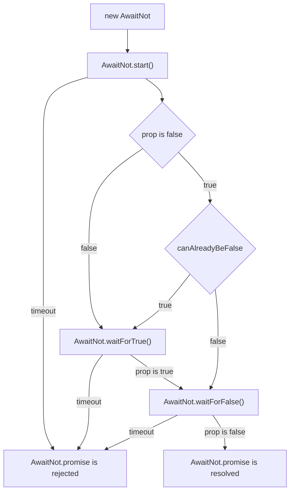

# reactive-helpers


[](https://docs.arrai-dev.com/reactive-helpers/artifacts/main/coverage_tests/)


Vue.js 3 utility composition functions to help manipulate objects and lists.

<!-- prettier-ignore-start -->
<!-- START doctoc generated TOC please keep comment here to allow auto update -->
<!-- DON'T EDIT THIS SECTION, INSTEAD RE-RUN doctoc TO UPDATE -->

- [Install](#install)
- [Usage](#usage)
  - [Import](#import)
  - [JSDocs](#jsdocs)
  - [List](#list)
    - [Instance](#instance)
    - [Subscription](#subscription)
    - [Related](#related)
    - [Calculated](#calculated)
    - [Filter](#filter)
    - [Sort](#sort)
    - [All](#all)
    - [List](#list-1)
  - [Object](#object)
  - [Search](#search)
  - [Utils](#utils)
    - [addOrUpdateReactiveObject & assignReactiveObject](#addorupdatereactiveobject--assignreactiveobject)
    - [keyDiff](#keydiff)
    - [set](#set)
    - [watches](#watches)
- [Development](#development)

<!-- END doctoc generated TOC please keep comment here to allow auto update -->
<!-- prettier-ignore-end -->

## Install

```console
$ npm install @arrai-innovations/reactive-helpers
```

## Usage

### Import

```js
// base import contains all exports
import { useListInstance, useObjectInstance } from "@arrai-innovations/reactive-helpers";
// you can also import individual modules
import { useListInstance } from "@arrai-innovations/reactive-helpers/use/listInstance";
// or the module categories
import { useObjectInstance } from "@arrai-innovations/reactive-helpers/use";
```

See the [JSDocs](./docs.md) for list of available modules and imports.

### JSDocs

[View the JSDocs](./docs.md)

### List

#### Instance

The container for your list of objects, providing loading or error status.

```js
// do this in your main.js
import { setListCrud } from "@arrai-innovations/reactive-helpers";

setListCrud({
    list: async function listCrudAdaptor({ crudArgs, retrieveArgs, listArgs, pageCallback }) {
        // todo: your implemenation here.
        const listOfObjects = await talkToServer(crudArgs, retrieveArgs, listArgs);
        pageCallback(listOfObjects);
        const nextListOfObjects = await talkToServerAgain(crudArgs, retrieveArgs, listArgs);
        pageCallback(nextListOfObjects);
    },
});
```

```js
// then use in your component
import { useListInstance } from "@arrai-innovations/reactive-helpers";
import { reactive } from "vue";

const listProps = reactive({
    // crudArgs are implementation specific to your crud functions.
    crudArgs: {
        stream: "contacts",
    },
    retrieveArgs: {
        fields: ["id", "has_name", "lexical_name", "organization", "phone"],
    },
    listArgs,
});
const contacts = useListInstance({
    props: listProps,
});

await contacts.list();
console.log(contacts.loading);
// False
console.log(contacts.errored);
// False
console.log(contacts.error);
// null
console.log(contacts.objects);
// { contacts keyed by 'id' }
// change list or retrieve args directly
contacts.state.retrieveArgs.fields.push("message_count");
await contacts.list();
console.log(contacts.objects);
// { contacts keyed by 'id' with message_count  }
// change list or retrieve args indirectly
listProps.listArgs.has_organization = false;
await contacts.list();
console.log(contacts.objects);
// { contacts keyed by 'id' with organizationless contacts  }
```

#### Subscription

Adds functionality to a list instance to receive updates from the server.

```js
// do this in your main.js
import { setListCrud } from "@arrai-innovations/reactive-helpers";
setListCrud({
    ..., // in addition to the list crud adaptor above
    subscribe: function subscribeCrudAdaptor({ crudArgs, retrieveArgs, listArgs, eventCallback }) {
        // todo: your implemenation here.
        const subscription = talkToServer(function (data, action) {
            eventCallback(data, action);
        });
        // return a promise with a cancel action
        subscription.cancel = async () => {
            await cancelSubOnServer();
        };
        return subscription;
    },
});
```

```js
// then use in your component
import { useListInstance, useListSubscription } from "@arrai-innovations/reactive-helpers";

const listProps = reactive({
    // crudArgs are implementation specific to your crud functions.
    crudArgs: {
        stream: "contacts",
        includeCreateEvents: true,
        subscribeAction: "subscribe_contacts",
        unsubscribeAction: "unsubscribe_contacts",
    },
    retrieveArgs: {
        fields: ["id", "has_name", "lexical_name", "organization", "phone"],
    },
    listArgs: {
        has_organization: true,
    },
});
const contacts = useListInstance({
    props: listProps,
});
const contactsSubscription = useListSubscription({
    listInstance: contacts,
});

// only get new or updated contacts, not existing.
contactsSubscription.subscribe();
// or, subscribe and get the existing list.
contactsSubscription.subscribe();
// stop getting updates.
contactsSubscription.unsubscribe();
// re-retreive the list of existing contacts including another field.
contacts.retrieveArgs.fields.push("message_count");
// re-retreive the list of all existing contacts.
delete contacts.listArgs.has_organization;
```

```js
// or you can have listSubscription create the listInstance for you.
import { useListSubscription } from "@arrai-innovations/reactive-helpers";

const listProps = reactive({
    // crudArgs are implementation specific to your crud functions.
    crudArgs: {
        stream: "contacts",
        includeCreateEvents: true,
        subscribeAction: "subscribe_contacts",
        unsubscribeAction: "unsubscribe_contacts",
    },
    retrieveArgs: {
        fields: ["id", "has_name", "lexical_name", "organization", "phone"],
    },
    listArgs: {
        has_organization: true,
    },
});
const contactsSubscription = useListSubscription({
    props: listProps,
});
```

#### Related

Lookup foreign keys between list instances via watch, for using dot notation in templates to cross object relations.

```js
// no main.js setup required.
// used in example below.
// use in your component
import { useListInstance, useListRelated } from "@arrai-innovations/reactive-helpers";
import { nextTick } from "vue";

const organizations = useListInstance({
    props: {
        retrieveArgs: {
            fields: ["id", "name"],
        },
    },
});
const contacts = useListInstance({
    props: {
        retrieveArgs: {
            fields: ["id", "lexical_name", "organization"],
        },
    },
});
const contactsRelated = useListRelated({
    parentState: contacts.state,
    relatedObjectsRules: {
        organization: {
            // desired key on relatedObjects
            objects: toRef(organizations.state, "objects"), // organizations by id
            pkKey: "organization", // reference key on contact for org id.
        },
    },
});
await organizations.list();
await contacts.list();
console.log(organizations.objects);
/*
{
    "24": { "id": 24, "name": "org 24" },
    "42": { "id": 42, "name": "org 42" },
}
*/
console.log(contacts.objects);
/*
{
    "15": {
        "id": 15,
        "lexical_name": "one, contact",
        "organization": 42,
    }
}
*/
console.log(contacts.relatedObjects);
/*
{
    "15": {
        "organization": { "id": 42, "name": "org 42" }
    }
}
 */
contacts.objects["15"].organization = 24;
await nextTick();
console.log(contacts.relatedObjects["15"]);
/*
{
    "organization": { "id": 24, "name": "org 24" }
}
*/
delete contactsRelated.relatedObjectRules.organization;
await nextTick();
console.log(contacts.relatedObjects["15"]);
/* {} */
// manual stopage. inside a setup or another effect scope, there isnt a need to manually call this.
contactsRelated.effectScope.stop();
await nextTick();
```

#### Calculated

```js
// no main.js setup required.
// used in example below.
// use in your component
import { useListInstance, useListCalculated } from "@arrai-innovations/reactive-helpers";
import { nextTick } from "vue";

const contacts = useListInstance({
    retrieveArgs: {
        fields: ["id", "has_name", "has_billing", "lexical_name", "organization"],
    },
});
const contactsCalculated = useListCalculated({
    parentState: contacts.state,
    calculatedObjectsRules: {
        first_letter_of_name: (object) => {
            return object.lexical_name[0];
        },
    },
});
await contacts.list();
console.log(contacts.objects);
/*
{
    "15": {
        "id": 15,
        "lexical_name": "one, contact",
        "organization": 42,
    },
    "16": {
        "id": 16,
        "lexical_name": "two, contact",
        "organization": 42,
    },
}
*/
console.log(contacts.calculatedObjects);
/*
{
    "15": {
        "first_letter_of_name": "o"
    },
    "16": {
        "first_letter_of_name": "t"
    },
}
*/
```

#### Filter

```js
// no main.js setup required.
// used in example below.
// use in your component
import { useListInstance, useListFilter } from "@arrai-innovations/reactive-helpers";
import { nextTick } from "vue";

const contacts = useListInstance({
    retrieveArgs: {
        fields: ["id", "has_name", "has_billing", "lexical_name", "organization"],
    },
});

// conditions are all optional but anded together if present.
const contactsFilter = useListFilter({
    parentState: contacts.state,
    allowedFilter: function (object) {
        return object.has_name === true;
    },
    excludedFilter: function (object) {
        return object.has_billing === true;
    },
});
await contacts.list();
console.log(contactsFilter.state.objects);
console.log(contactsFilter.state.objectsInOrder);
console.log(contactsFilter.state.order);
contacts.objects["15"].has_name = false;
await nextTick();
console.log(contactsFilter.state.objects);
console.log(contactsFilter.state.objectsInOrder);
console.log(contactsFilter.state.order);
```

#### Sort

```js
// no main.js setup required.
// used in example below.
// use in your component
import { useListInstance, useListSort } from "@arrai-innovations/reactive-helpers";
import { nextTick } from "vue";

const contacts = useListInstance({
    props: {
        retrieveArgs: {
            fields: ["id", "has_name", "lexical_name", "organization"],
        },
    },
});
const contactsSort = useListSort({
    parentState: contacts.state,
    orderByRules: [
        { key: "has_name", desc: true, localeCompare: false },
        { key: "lexical_name", desc: false, localeCompare: true },
    ],
    sortThrottleWait: 100, // default, ms to wait before sorting after a change.
});
await contacts.list();
console.log(contactsSort.state.order);
// array of ids in order, based on the specified rules.
console.log(contactsSort.state.objectsInOrder);
// computed array of the previous that also looks up the object ids in .objects
contactsSort.state.orderByRules[0].desc = false;
await nextTick();
console.log(contactsSort.state.order);
// array of ids in order, based on updated rules.
```

#### All

Example using all of the above.

```js
import {
    useListInstance,
    useListSubscription,
    useListRelated,
    useListCalculated,
    useListFilter,
    useListSort,
} from "@arrai-innovations/reactive-helpers";

const organizationNameSearch = ref("");
const organizations = useListInstance({
    // crudArgs are implementation specific to your crud functions.
    crudArgs: {
        stream: "organizations",
    },
});
const contacts = useListInstance({
    // crudArgs are implementation specific to your crud functions.
    crudArgs: {
        stream: "contacts",
    },
    retrieveArgs: {
        fields: ["id", "has_name", "lexical_name", "organization", "phone"],
    },
    listArgs: {
        has_organization: true,
    },
});
const contactsSubscription = useListSubscription({
    // crudArgs are implementation specific to your crud functions.
    crudArgs: {
        stream: "contacts",
        includeCreateEvents: true,
    },
    listInstance: contacts,
});
const contactsRelated = useListRelated({
    parentState: contactsSubscription.state,
    relatedObjectsRules: {
        organization: {
            // desired key on relatedObjects
            objects: toRef(organizations.state, "objects"), // organizations by id
            pkKey: "organization", // reference key on contact for org id.
        },
    },
});
const contactsCalculated = useListCalculated({
    parentState: contactsRelated.state,
    calculatedObjectsRules: {
        first_letter_of_name: (object) => {
            return object.lexical_name[0];
        },
    },
});
const contactsFiltered = useListFilter({
    parentState: contactsCalculated.state,
    useTextSearch: true,
    textSearchRules: ["relatedObjects.organization.name"],
    textSearchValue: organizationNameSearch,
});
const contactsSorted = useListSort({
    parentState: contactsFiltered.state,
    orderByRules: [
        { key: "relatedObjects.organization.name", desc: false, localeCompare: true },
        { key: "lexical_name", desc: false, localeCompare: true },
    ],
});
console.log(contactsSorted.state.value.objects);
// object of contacts, updating as new ones are created, filtered by organziation name, sort organization name & lexical name.
console.log(contactsSorted.state.value.order);
// array of ids in order, based on the specified rules.
console.log(contactsSorted.state.value.objectsInOrder);
// array of contacts, updating as new ones are created, filtered by organziation name, sort organization name & lexical name.
console.log(contactsSorted.state.value.calculatedObjects);
// object of calculated objects, updating as new ones are created, for objects above.
console.log(contactsSorted.state.value.relatedObjects);
// object of related objects, updating as new ones are created, for objects above.
```

#### List

```js
// you can also let the library manage a full stack for you.
import { useList } from "@arrai-innovations/reactive-helpers";
import { reactive } from "vue";

const managedListProps = reactive({
    // crudArgs are implementation specific to your crud functions.
    crudArgs: {
        stream: "contacts",
        includeCreateEvents: true,
        subscribeAction: "subscribe_contacts",
        unsubscribeAction: "unsubscribe_contacts",
    },
    retrieveArgs: {
        fields: ["id", "has_name", "lexical_name", "organization", "phone"],
    },
    listArgs: {
        has_organization: true,
    },
    relatedObjectsRules: {
        organization: {
            // desired key on relatedObjects
            objects: toRef(organizations.state, "objects"), // organizations by id
            pkKey: "organization", // reference key on contact for org id.
        },
    },
    calculatedObjectsRules: {
        first_letter_of_name: (object) => {
            return object.lexical_name[0];
        },
    },
    orderByRules: [
        { key: "relatedObjects.organization.name", desc: false, localeCompare: true },
        { key: "lexical_name", desc: false, localeCompare: true },
    ],
    useTextSearch: true,
    textSearchRules: ["relatedObjects.organization.name"],
    textSearchValue: organizationNameSearch,
    sortThrottleWait: 100, // default, ms to wait before sorting after a change.
});
const managedList = useList({
    props: managedListProps,
    functions: {
        list: customListFunction,
        subscribe: customSubscribeFunction,
    },
});
// the state expected of each are all available on the same state.
console.log(managedList.state.value.objects);
// managed instances can also be accessed directly.
console.log(managedList.managed);
/*
{
    listInstance: {...},
    listSubscription: {...},
    listRelated: {...},
    listCalculated: {...},
    listFilter: {...},
    listSort: {...},
}
*/
// the stack is applied in the order of the keys as by managedList.managed.
```

### Object

```js
// do this in your main.js
import { setObjectCrud } from "@arrai-innovations/reactive-helpers";

setObjectCrud({
    create: async function createCrudAdaptor({ crudArgs, retrieveArgs, object }) {
        // todo: your implemenation here.
        const newObject = await talkToServer(object);
        return newObject;
    },
    retrieve: async function retrieveCrudAdaptor({ crudArgs, retrieveArgs, id }) {
        // todo: your implemenation here.
        const retrievedObject = await talkToServer(id);
        return retrievedObject;
    },
    update: async function updateCrudAdaptor({ crudArgs, retrieveArgs, object }) {
        // todo: your implemenation here.
        const updatedObject = await talkToServer(object);
        return updatedObject;
    },
    delete: async function deleteCrudAdaptor({ crudArgs, id }) {
        // todo: your implemenation here.
        await talkToServer(id);
    },
    patch: async function patchCrudAdaptor({ crudArgs, retrieveArgs, id, partialObject }) {
        // todo: your implemenation here.
        const patchedObject = await talkToServer(object);
        return patchedObject; // still return the full object.
    },
    subscribe: function subscribeCrudAdaptor({ crudArgs, retrieveArgs, listArgs, eventCallback }) {
        // todo: your implemenation here.
        const subscription = talkToServer(function (data, action) {
            eventCallback(data, action);
        });
        // return a promise with a cancel action
        subscription.cancel = async () => {
            await cancelSubOnServer();
        };
        return subscription;
    },
});
```

```js
// similar to list, but for a single object.
import {
    useObjectInstance, useObjectSubscription, useObjectRelated, useObjectCalculated
} from "@arrai-innovations/reactive-helpers";

const contactObject = useObjectInstance({
    props: {
        crudArgs: {
            stream: "contacts",
        },
        retrieveArgs: {
            fields: ["id", "has_name", "lexical_name", "organization", "phone"],
        },
        id: contactId,
    }
});
console.log(contactObject.state.object);
const contactSubscription = useObjectSubscription({
    objectInstance: contactObject,
})
// or
const contactSubscription = useObjectSubscription({
    props: {
        crudArgs: {
            stream: "contacts",
        },
        retrieveArgs: {
            fields: ["id", "has_name", "lexical_name", "organization", "phone"],
        },
        id: contactId,
    }
});
console.log(contactSubscription.state.object);
const organizations = useList({
    props: {
        crudArgs: {
            stream: "organizations",
        },
        retrieveArgs: {
            fields: ["id", "name"],
        },
    }
});
await organizations.list();
const contactRelated = useObjectRelated({
    parentState: contactSubscription.state,
    relatedObjectRules: {
        organization: {
            // desired key on relatedObjects
            objects: toRef(organizations.state, "objects"), // organizations by id
            pkKey: "organization", // reference key on contact for org id.
        },
    },
});
console.log(contactRelated.state.object.relatedObject.organization.name);
const contactCalculated = useObjectCalculated({
    parentState: contactSubscription.state,
    calculatedObjectRules: {
        first_letter_of_name: (object) => {
            return object.lexical_name[0];
        },
    },
});
console.log(contactCalculated.state.object.calculatedObject.first_letter_of_name);
```

```js
// you can also let the library managed a full stack for you.
import { useObject } from "@arrai-innovations/reactive-helpers";
import { reactive } from "vue";

const managedObjectProps = reactive({
    crudArgs: {
        stream: "contacts",
    },
    retrieveArgs: {
        fields: ["id", "has_name", "lexical_name", "organization", "phone"],
    },
    id: contactId,
    relatedObjectRules: {
        organization: {
            // desired key on relatedObjects
            objects: toRef(organizations.state, "objects"), // organizations by id
            pkKey: "organization", // reference key on contact for org id.
        },
    },
    calculatedObjectRules: {
        first_letter_of_name: (object) => {
            return object.lexical_name[0];
        },
    },
});
const managedObject = useObject({
    props: managedObjectProps,
    functions: {
        retrieve: customRetrieveFunction,
        subscribe: customSubscribeFunction,
    },
});
// the state expected of each are all available on the same state.
console.log(managedObject.state.value.objects);
// managed instances can also be accessed directly.
console.log(managedObject.managed);
/*
{
    objectInstance: {...},
    objectSubscription: {...},
    objectRelated: {...},
    objectCalculated: {...},\
}
*/
// the stack is applied in the order of the keys as by managedObject.managed.
```

### Search

```js
// no main.js setup required.
import { useSearch } from "@arrai-innovations/reactive-helpers";

const search = useSearch({});
```

### Utils

#### addOrUpdateReactiveObject & assignReactiveObject

`addOrUpdateReactiveObject` - Assigns properties of a source object onto a target object, using refs if both source and
target are reactive.

`assignReactiveObject` - same as `addOrUpdateReactiveObject`, but deletes keys from target that are not in source.

```js
import { assignReactiveObject, addOrUpdateReactiveObject } from "@arrai-innovations/reactive-helpers";
import { reactive, toRef, computed } from "vue";

const target = reactive({ a: 1 });
const source = { a: 3, b: 4 };
const source2 = reactive({ b: 5 });

const a = toRef(target, "a");
const b = toRef(target, "b");
const mySum = computed(() => (a.value || 0) + (b.value || 0));

console.log(mySum.value); // 1
assignReactiveObject(target, source);
console.log(mySum.value); // 7
addOrUpdateReactiveObject(target, source2);
console.log({ ...target }); // { a: 3, b: 5 }
console.log(mySum.value); // 8
source2.b = 6;
console.log(mySum.value); // 9
assignReactiveObject(target, source2);
console.log({ ...target }); // { b: 6 }
console.log(mySum.value); // 6
source2.b = 10;
console.log(mySum.value); // 10
```

#### keyDiff

`keyDiff` - returns the various set results related to figuring out the changes in keys over time on an object or related objects. Returns the intersection as sameKeys, the difference of old and new as removedKeys, and the difference of new and old as addedKeys.

```js
import { keyDiff } from "@arrai-innovations/reactive-helpers";

const newKeys = Object.keys({ a: 1, b: 2 });
const oldKeys = Object.keys({ a: 1, c: 3 });
const { addedKeys, removedKeys, sameKeys } = keyDiff(newKeys, oldKeys);
console.log({ addedKeys, removedKeys, sameKeys });
// { addedKeys: Set(1) { 'b' }, removedKeys: Set(1) { 'c' }, sameKeys: Set(1) { 'a' } }
```

#### set

We make use of the basic set operations provided as example on mdn:
https://developer.mozilla.org/en-US/docs/Web/JavaScript/Reference/Global_Objects/Set#implementing_basic_set_operations

```js
import {
    isSuperset,
    union,
    intersection,
    symmetricDifference,
    difference,
    equals,
} from "@arrai-innovations/reactive-helpers";

isSuperset(new Set([1, 2, 3, 4]), new Set([1, 2, 3])); // true
union(new Set([1, 2, 3, 4]), new Set([1, 2, 3])); // Set { 1, 2, 3, 4 }
intersection(new Set([1, 2, 3, 4]), new Set([1, 2, 3])); // Set { 1, 2, 3 }
symmetricDifference(new Set([1, 2, 3, 4]), new Set([1, 2, 3, 5])); // Set { 4, 5 }
difference(new Set([1, 2, 3, 4]), new Set([1, 2, 3, 5])); // Set { 4 }
difference(new Set([1, 2, 3, 5]), new Set([1, 2, 3, 4])); // Set { 5 }
equals(new Set([1, 2, 3, 4]), new Set([1, 2, 3, 5])); // false
```

#### watches

`ImmediateStopWatch` - a vue.js watch that can be stopped in the first iteration

```js
import { ImmediateStopWatch } from "@arrai-innovations/reactive-helpers";

const reactiveObject = reactive({ a: 1 });
const watch = new ImmediateStopWatch();
const watch2 = new ImmediateStopWatch();
watch.start(
    () => reactiveObject.a,
    (newA) => {
        if (newA === 2) {
            console.log("a is now 2!");
            watch.stop();
        }
    },
    [reactiveObject.a]
);
watch2.start(
    () => reactiveObject.a,
    (newA) => {
        if (newA === 1) {
            console.log("a is now 1!");
            watch2.stop();
        }
    },
    [reactiveObject.a]
);
// a is now 1!
await nextTick();
reactiveObject.a = 2;
await nextTick();
// a is now 2!
await nextTick();
reactiveObject.a = 1;
await nextTick();
// no output;
reactiveObject.a = 2;
await nextTick();
// no output;
```

`AwaitTimeout` - a class that provides a promise that resolves after a timeout.

```js
import { AwaitTimeout } from "@arrai-innovations/reactive-helpers";

const awaitTimeout = new AwaitTimeout({ timeout: 1000 });
awaitTimeout.start();
await awaitTimeout.promise; // waits 1 second
const awaitTimeout2 = new AwaitTimeout({ timeout: 1000 });
awaitTimeout2.start();
setTimeout(() => awaitTimeout2.stop(), 500);
await awaitTimeout2.promise; // waits 500 ms then rejects with new AwaitTimeoutError("Cancelled", "timeout_cancelled")
```

`doAwaitTimeout` - a function that returns a promise that resolves after a timeout.

```js
import { doAwaitTimeout } from "@arrai-innovations/reactive-helpers";

// non cancellable AwaitTimeout helper
await doAwaitTimeout(1000); // waits 1 second
```

`AwaitNot` - a class that provides a promise that resolves when a watched prop switches to true then to false.



```js
import { AwaitNot } from "@arrai-innovations/reactive-helpers";
import { reactive } from "vue";

const reactiveObject = reactive({});

const awaitNot = new AwaitNot({
    obj: reactiveObject,
    prop: "prop",
    couldAlreadyBeFalse: true, // default
    timeout: 1000, // default
});
awaitNot.promise
    .then(() => {
        console.log("resolved");
    })
    .catch(() => {
        console.log("rejected");
    });
awaitNot.start();
await nextTick();
reactiveObject.prop = true;
await nextTick();
reactiveObject.prop = false;
await nextTick();
// resolved
const awaitNot2 = new AwaitNot({
    obj: reactiveObject,
    prop: "prop",
    couldAlreadyBeFalse: true, // default
    timeout: 500,
});
awaitNot2.promise
    .then(() => {
        console.log("resolved");
    })
    .catch(() => {
        console.log("rejected");
    });
awaitNot2.start();
await awaitNot2.promise;
// rejected
const awaitNot3 = new AwaitNot({
    obj: reactiveObject,
    prop: "prop",
    couldAlreadyBeFalse: false,
    timeout: 1000, // default
});
awaitNot3.promise
    .then(() => {
        console.log("resolved");
    })
    .catch(() => {
        console.log("rejected");
    });
awaitNot3.start();
await awaitNot3.promise;
// resolved
```

## Development

1. Checkout this repo:
    ```bash
    $ git clone git@github.com:arrai-innovations/reactive-helpers.git
    ```
2. Install dependencies:
    ```bash
    $ npm ci
    ```
3. Run tests via jest:
    ```bash
    $ npm test
    ```
4. Run tests with coverage output:
    ```bash
    $ npm run coverage
    ```
